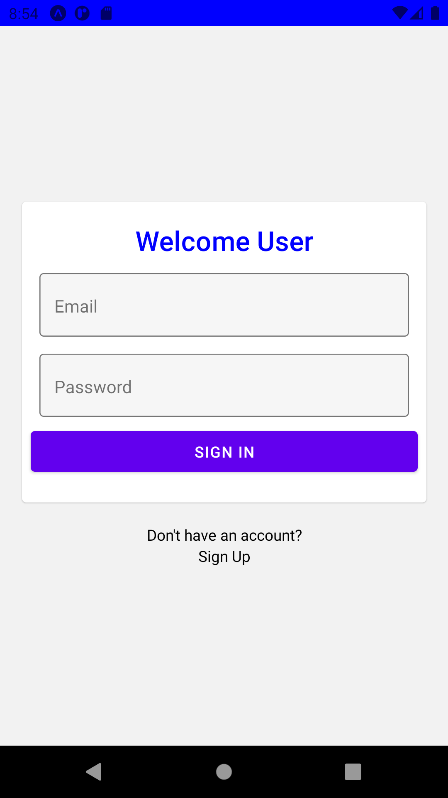
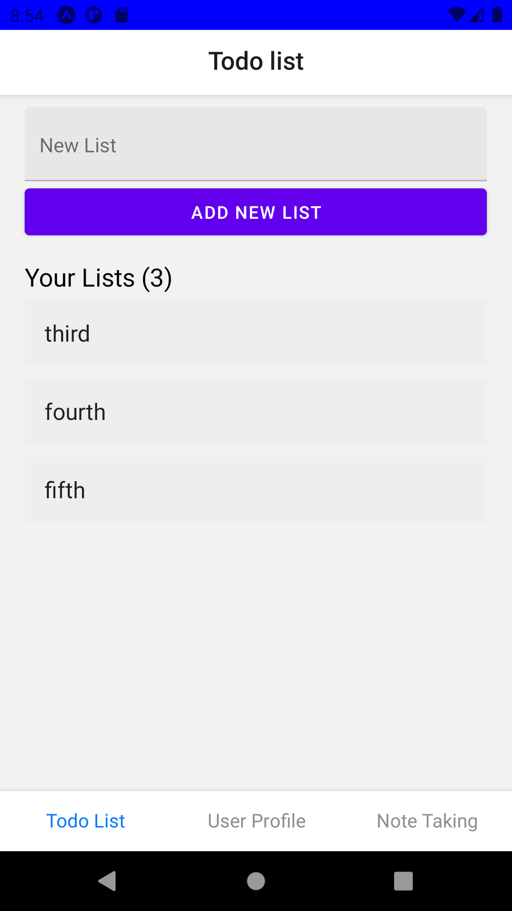
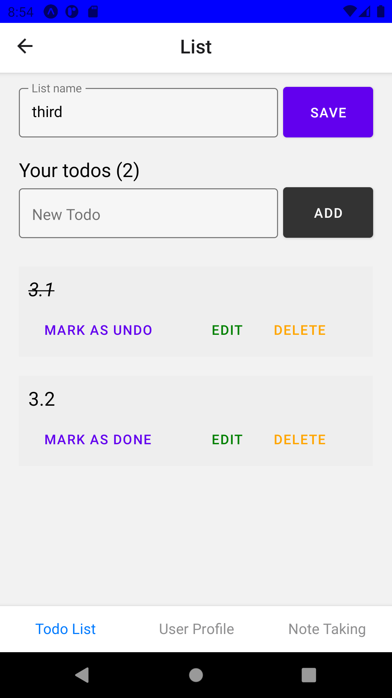
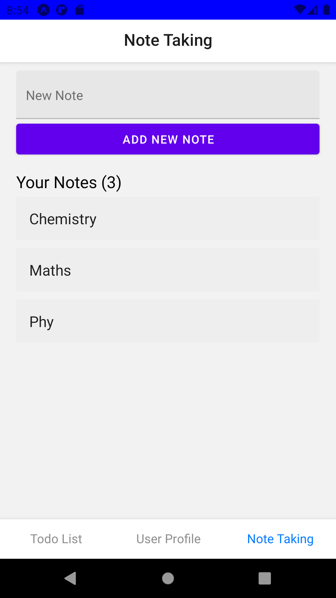
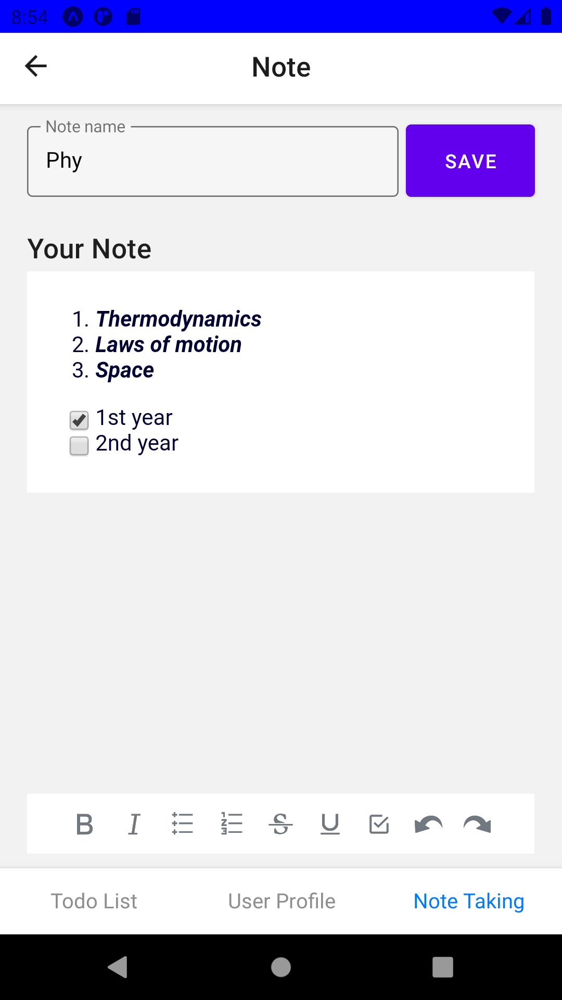
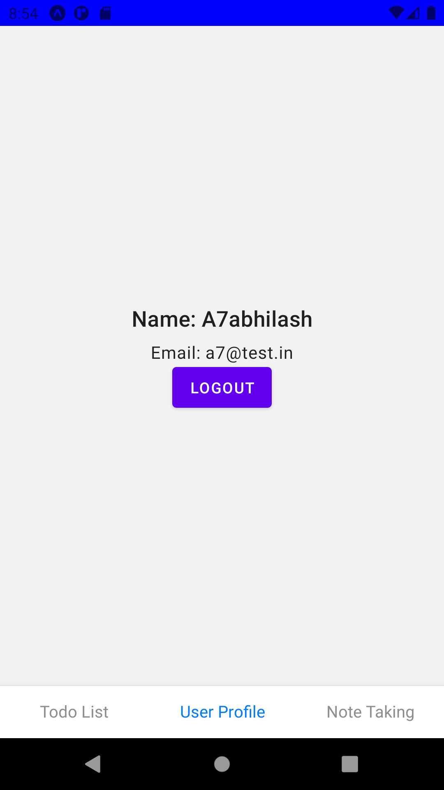

# Walnote-App

> Note Taking and Todo List App.

#### Technology used

> Stack: MERnN.

#### Features

> **Create Tasks:** Add different categories of lists and setup tasks/todos for each.  
> **Take Notes:** Keep notes organized and add any type of content.  
> **User Security:** This application ensures User Authentication, Authorization & Data Encryption.

### Screenshots

<h6>
#1 Login Screen(!Auth) | #2 TodoList Screen | #3 List Screen | #4 Notes Screen | #5 Note Screen | #6 User Screen  
</h6>

> > [Web Application(Repo)](https://github.com/A7abhilash/walnote)
